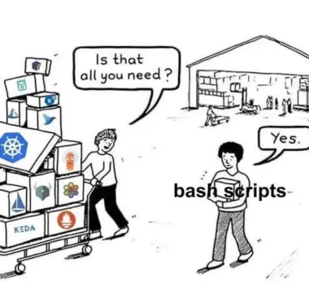

# Scripts Collection Documentation
This repository contains a collection of useful scripts for various tasks and integrations. Below you'll find detailed information about each component and how to use them.

## Usage

### Running Without Installation
Scripts can be run directly from the repository without installation:

```bash
# Pattern
./<provider>/<script-name>.sh [arguments]

# Examples
./gitlab/mr-create.sh main -m "Fix user authentication"
./clickup/task-get.sh -t 987654321 -me -s "in progress"
./clickup/team-get.sh -s "john" -c "name,email"
```

### Installation (Optional)
For convenience, scripts can be installed system-wide to `/usr/local/lib/scripts` and run with the `scripts` command:

```bash
# Pattern after installation
scripts <provider> <action>

# Examples after installation
scripts gitlab mr-create <target_branch> [-m "MR Title"]
scripts clickup task-get -t 987654321 -me -s "in progress"
```

The repository includes an installation script (`install.sh`) that:
- Installs the scripts to `/usr/local/lib/scripts`
- Sets up auto-completion for the scripts
- Requires root privileges to install
- Adds necessary bash completion configurations

To install, run:
```bash
sudo ./install.sh
```

## Update
To update the scripts to the latest version, you can use the update command:

```bash
sudo scripts update
```

The update process:
- Downloads the latest version from GitHub
- Uninstalls the current version
- Installs the new version
- Requires root privileges to update

## Uninstallation
To remove the scripts from your system, you can use the uninstall command:

```bash
sudo scripts uninstall [flag]
```

Available flags:
- `-v, --verbose`: Show detailed information about what's being removed

Alternatively, you can run the uninstall script directly:
```bash
sudo ./uninstall.sh
```

## Available Scripts

### GitLab Integration

#### 1. Merge Request Creation (`gitlab/mr-create.sh`)
A script to automate merge request creation in GitLab.

**Features:**
- Automatically creates merge requests from current branch
- Uses GitLab API with private token authentication
- Extracts commit message as MR title by default
- Supports custom MR title with -m flag
- Supports custom target branch selection
- Requires `GITLAB_PRIVATE_TOKEN` environment variable
- Uses git config for PROJECT_ID and ASSIGNEE_ID

**Usage:**
```bash
mr-create.sh [target-branch] [-m "MR Title"]
mr-create.sh -m "MR Title" [target-branch]
```

**Required Git Configuration:**
```bash
# Set your GitLab project ID
git config --worktree --add remote.origin.projectid <PROJECT_ID>

# Set your GitLab user ID for assignment
git config --worktree --add remote.origin.assigneeid <ASSIGNEE_ID>
```

**Note:** GitLab numeric User ID can be found at https://gitlab.com/api/v4/users?username=<USERNAME>

### ClickUp Integration

#### 1. Task Update (`clickup/task-update.sh`)
Manages ClickUp tasks through command line interface.

**Features:**
- Updates task status in ClickUp
- Handles multiple task IDs
- Requires `CU_PERSONAL_TOKEN` environment variable
- Supports parent task relationships

**Usage:**
```bash
task-update.sh [task-ids] [status]
```

#### 2. Task Get (`clickup/task-get.sh`)
Retrieves tasks from ClickUp lists or teams with filtering options.

**Features:**
- Gets tasks from a specific list or team
- Filters tasks by assignees, status, or current user
- Supports `--only-me` flag to filter by authenticated user
- Requires `CU_PERSONAL_TOKEN` environment variable
- Displays task ID, name, status, assignees, and URL

**Usage:**
```bash
task-get.sh -l <LIST_ID> [-a <ASSIGNEE_IDS>] [-s <STATUS>] [-me]  # Get tasks from specific list
task-get.sh -t <TEAM_ID> [-a <ASSIGNEE_IDS>] [-s <STATUS>] [-me] # Get tasks from team
```

**Examples:**
```bash
# Get all tasks from a list
scripts clickup task-get -l 123456789

# Get tasks assigned to specific users from a list
scripts clickup task-get -l 123456789 -a "12345,67890"

# Get your tasks from team with specific status
scripts clickup task-get -t 987654321 -me -s "in progress"

# Get tasks assigned to you from a list
scripts clickup task-get -l 123456789 -me
```

#### 3. Team Get (`clickup/team-get.sh`)
Lists ClickUp teams and their members in organized tables.

**Features:**
- Shows teams with ID and name headers
- Displays members in tables under each team
- Case-insensitive sorting by member name
- Column selection and filtering options
- Search members by name (case-insensitive)
- Filter teams by member email

**Usage:**
```bash
team-get.sh [-e <EMAIL>] [-s <SEARCH>] [-c <COLUMNS>]
```

**Examples:**
```bash
# Show all teams and members
scripts clickup team-get

# Show only specific columns
scripts clickup team-get -c "name,email"

# Search for members by name
scripts clickup team-get -s "john"

# Filter teams by member email
scripts clickup team-get -e "example.com"

# Combine filters
scripts clickup team-get -e "example.com" -s "smith" -c "name,email"
```

**Available columns:** `id`, `name`, `email`, `status`

#### 4. User Info (`clickup/user-info.sh`)
Retrieves current user information from ClickUp.

**Features:**
- Shows your ClickUp user ID, username, email, and color
- Useful for finding your user ID for assignee filtering
- Requires `CU_PERSONAL_TOKEN` environment variable

**Usage:**
```bash
scripts clickup user-info
```

#### 5. Space Get (`clickup/space-get.sh`)
Lists spaces within a ClickUp team.

**Features:**
- Shows all spaces in a team
- Displays space ID and name
- Requires `CU_PERSONAL_TOKEN` environment variable

**Usage:**
```bash
space-get.sh -t <TEAM_ID>
```

**Example:**
```bash
scripts clickup space-get -t 987654321
```

#### 6. List Get (`clickup/list-get.sh`)
Retrieves lists from a ClickUp space.

**Features:**
- Shows all lists in a space
- Displays list ID, name, and task count
- Requires `CU_PERSONAL_TOKEN` environment variable

**Usage:**
```bash
list-get.sh -s <SPACE_ID>
```

**Example:**
```bash
scripts clickup list-get -s 123456789
```

### Microsoft Teams Integration

#### 1. Message Sending (`ms-teams/message-send.sh`)
Sends messages to Microsoft Teams channels via webhooks.

**Features:**
- Sends messages to Teams channels
- Uses webhook URLs for authentication
- Simple POST request implementation

**Usage:**
```bash
message-send.sh
```

### Life Utilities
Some unneccesary commands

## Requirements
- Bash shell environment
- `curl` for API requests
- `jq` for JSON processing
- `rsync` for installation
- `unzip` for update process
- Proper environment variables set for various integrations

## Environment Variables
The following environment variables are required for different scripts:

- `GITLAB_PRIVATE_TOKEN`: For GitLab operations
- `CU_PERSONAL_TOKEN`: For ClickUp operations

## Notes
- All scripts are executable shell scripts
- Each script performs input validation
- Error handling is implemented for API responses
- Scripts follow a consistent pattern for environment variable checking

<br>



This documentation was generated by [Amazon Q](https://aws.amazon.com/q/developer/) with minimal modifications.